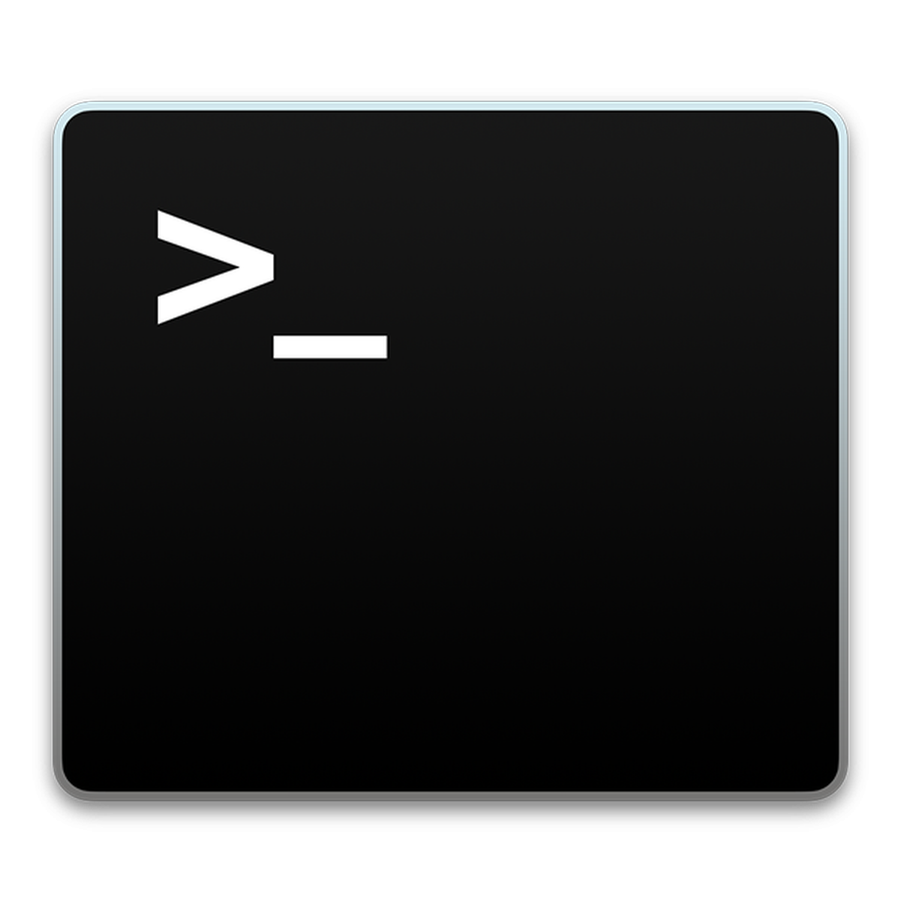

<div align="center">

  

</div>

- [Introduction to Git](#introduction-to-git)
  - [What is "Git"?](#what-is-git)
  - [Instalation](#instalation)
  - [Remote repositories](#remote-repositories)
    - [What is GitHub, GitLab and Bitbucket?](#what-is-github-gitlab-and-bitbucket)
- [Git commands](#git-commands)
  - [Start](#start)
    - [Clone a existing project](#clone-a-existing-project)
    - [Create a git project from scratch](#create-a-git-project-from-scratch)
    - [Create a new local repository](#create-a-new-local-repository)
  - [Commit Changes](#commit-changes)
    - [Add a commit](#add-a-commit)
    - [Show a commit](#show-a-commit)
    - [Add local changes to repository](#add-local-changes-to-repository)
  - [Delete the file from](#delete-the-file-from)
  - [Branches](#branches)
    - [Create a new branch](#create-a-new-branch)
    - [Switch to another branch and check it out into your working directory](#switch-to-another-branch-and-check-it-out-into-your-working-directory)
  - [Commit history](#commit-history)
    - [Show all commits in the actual branch and all files](#show-all-commits-in-the-actual-branch-and-all-files)
    - [Show all changes for a specific file](#show-all-changes-for-a-specific-file)
    - [Diff of what is changed but not staged](#diff-of-what-is-changed-but-not-staged)
    - [Commit your staged content as a new commit snapshot](#commit-your-staged-content-as-a-new-commit-snapshot)
  - [Undo](#undo)
    - [Discard all local changes](#discard-all-local-changes)
  - [Tags](#tags)
    - [Add a tag in current branch](#add-a-tag-in-current-branch)
- [Errors](#errors)
  - [Please use a personal access token instead](#Please-use-a-personal-access-token-instead)
- [Readme in other languages](#readme-in-other-languages)
- [Other tools and tips](#other-tools-and-tips)
  - [Add co-author](#Add-co-author)
  - [Graph](#graph)
  - [GUI Clients](#gui-clients)
    - [What is a "GUI" for git?](#what-is-a-gui-for-git)
  - [Visual Studio Code: extensions](#visual-studio-code-extensions)
- [References](#references)
- [Contributors](#contributors)

# Introduction to Git
## What is "Git"?

Git is the main **version control system** used in the world. Version control is a system that *records changes to a file or set of files over time so that you can recall specific versions later*.

This provides many advantages like multiple people working on the same project asynchronously, testing changes to a system without having to worry about reverting to a previous state if necessary, compare changes in files, maintaining different versions of the same system on the same place but separate, keep a history of changes for future reference, among others.

[Git Official page](https://git-scm.com/)

## Instalation

Debian/Ubuntu:
```bash
apt-get update
```

```bash
apt-get install git
```

Arch Linux:
```bash
pacman -S git
```

[Other Distributions](https://git-scm.com/download/linux)

-------

## Remote repositories

It is entirely possible to work with git locally on your machine without other contributors, since some of the benefits of git are keeping track of changes in time, so to clarify there's a separation between git and platforms like GitHub, GitLab, or Bitbucket; but teams and companies always work with remote repositories, and developing alone makes it so you never run into some of the problems git is great at solving, so it is important to understand how to work with those as well.

### What is GitHub, GitLab and Bitbucket?

They are all platforms that provide internet hosting for version control using Git. They also provide further tools for software development management like source code management, access management, bug tracking, feature requests, task management, continuous integration and documentation hosting, to name a few.

They let you upload code either publicly or on private repositories and integrate with git to use its many benefits.

<div align=center>

[GitHub](https://github.com/about) |
[GitLab](https://about.gitlab.com/) |
[Bitbucket](https://bitbucket.org/product/)

</div>

# Git commands



##
```bash
git config --list
```

## Start
### Clone a existing project

Once you have the repository url you clone it (which will download its main/master branch) with:
```bash
git clone <repository-url>
```

This will create a folder with the repository name wherever you are. If you want to specify a path or a folder name, simply add it as a argument:

```bash
git clone <repository-url> /path/to/git_folder
```

### Create a git project from scratch

Go to the directory with the project code (or an empty directory to start from zero) and run:

```bash
git init
```

This will create a new project where all files and subfolders are

```bash
git remote set-url origin https://github.com/Cygnus-Software/intro-git.git
```

*Note:* The remote url is generally the https repository url with a `.git` at the end

### Create a new local repository


---
## Commit Changes

```bash
git status
```

### Add a commit

```bash
git commit -m "Tittle commit example" -m "Commit description"
```

### Show a commit

```bash
git show <tag_commit>
```

### Add local changes to repository

```bash
git add
```

## Delete the file from

## Branches

### Create a new branch

```bash
git branch <name_branch>
```

### Switch to another branch and check it out into your working directory

```bash
git checkout <name_branch>
```

## Commit history

### Show all commits in the actual branch and all files

```bash
git log
```

### Show all changes for a specific file

```bash
git log -p <file>
```

### Diff of what is changed but not staged

```bash
git diff
```

### Commit your staged content as a new commit snapshot

```bash
git diff --staged
```

## Undo

### Discard all local changes

```bash
git reset --hard
```

## Tags

### Add a tag in current branch

```bash
git tag <tag-name>
```

# Errors
## Please use a personal access token instead

> [Get Token](https://docs.github.com/en/github/authenticating-to-github/authenticating-with-saml-single-sign-on/authorizing-a-personal-access-token-for-use-with-saml-single-sign-on)

```bash
[user@Cygnus Cygnus_intro_git]$ git push origin develop
remote: Support for password authentication was removed on August 13, 2021. Please use a personal access token instead.
remote: Please see https://github.blog/2020-12-15-token-authentication-requirements-for-git-operations/ for more information.
fatal: unable to access 'https://github.com/Cygnus-Software/intro-git.git/': The requested URL returned error: 403
```

```bash
git config --global --unset credential.helper
```

# Readme in other languages

[README ES](/README_ES.md)


---

# Other tools and tips

## Add co author
[How to add co-author](https://github.com/shirosweets/how-to-add-co-author)

## Graph

```bash
sudo apt install gitk
```

## GUI Clients
### What is a "GUI" for git?

https://git-scm.com/download/gui/linux

## Visual Studio Code: extensions
> Pair programming
[Live-Share](https://visualstudio.microsoft.com/es/services/live-share/)

---

# References
[Git Docs](https://git-scm.com/docs)
[Authentication](https://stackoverflow.com/questions/68775869/support-for-password-authentication-was-removed-please-use-a-personal-access-to)

# Contributors

<a href="https://github.com/Cygnus-Software/intro-git/graphs/contributors">
  
</a>
